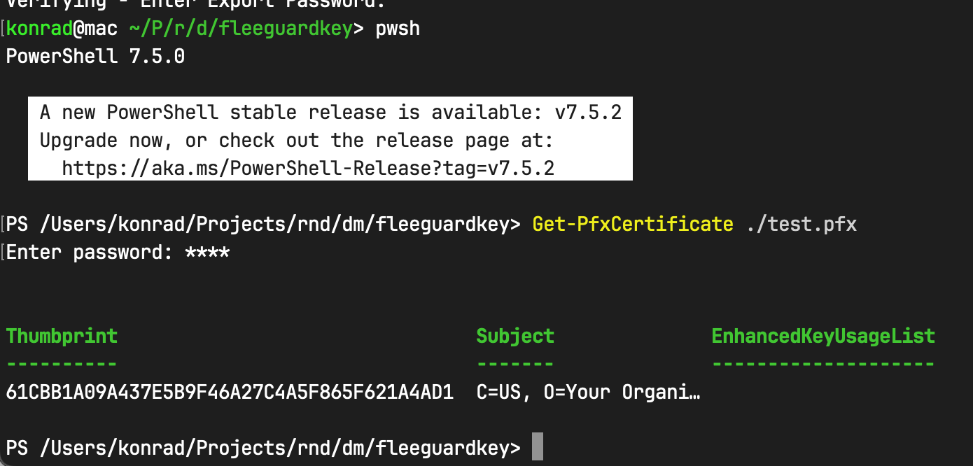
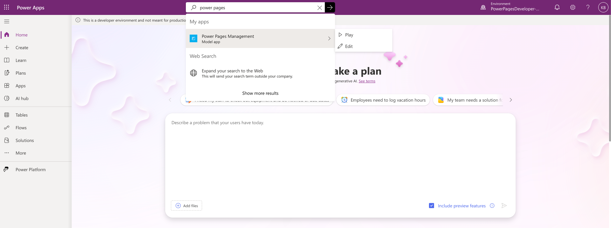
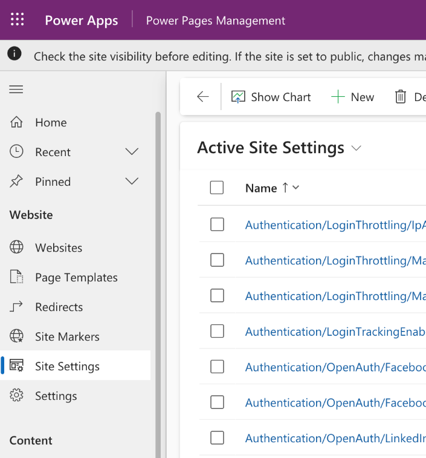
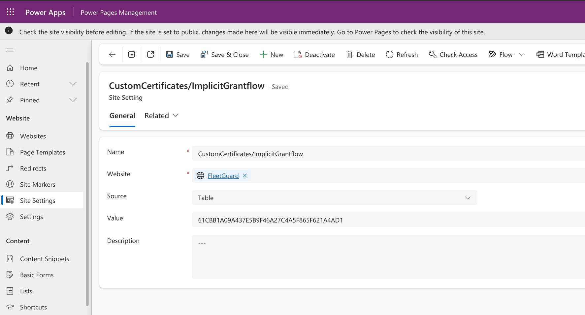
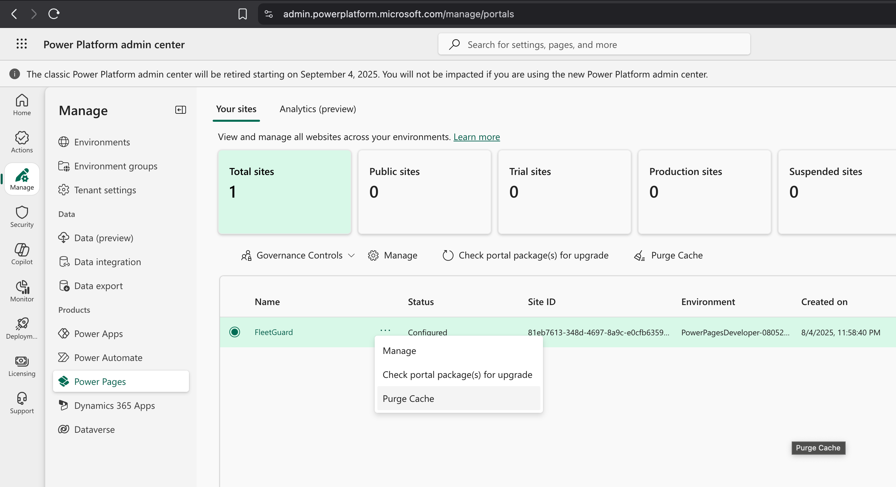
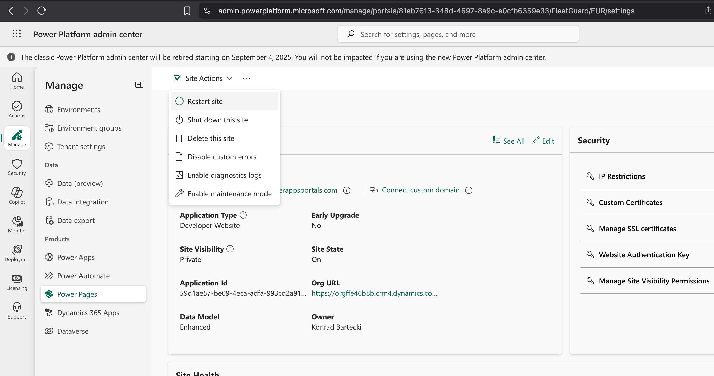
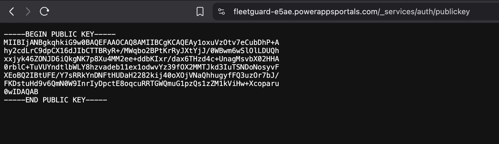

# **Securely Authenticate Power Pages Users with a Custom ASP.NET Web API**

## **Introduction**

When building powerful solutions on the Power Platform, you might find that certain complex workloads are better handled by a custom backend, such as an ASP.NET Web API. This presents a common challenge: how do you securely authenticate users who are already logged into your Power Pages portal when they need to call your custom API?

The goal is to avoid forcing users to log in again. We want to leverage their existing Power Pages session to seamlessly grant them access to the custom API.

This tutorial will guide you through the process of using the OAuth 2.0 Implicit Grant Flow to issue a JWT (JSON Web Token) from Power Pages. This token can then be validated by your custom ASP.NET Web API, effectively connecting your two systems securely.

## **The Authentication Flow: How It Works**

The core of this solution relies on public-key cryptography and a standard authentication flow. Here's a high-level overview:

1.  **Public/Private Key Pair:** We will generate a digital certificate, which contains a public and private key.
2.  **Power Pages (The Signer):** We'll configure Power Pages with the certificate. When a logged-in user requests a token, Power Pages uses the **private key** to sign a JWT. This token contains information about the user (their claims) and is cryptographically signed to prove its origin.
3.  **Custom Web API (The Verifier):** Your API will fetch the **public key** from a specific Power Pages endpoint. When your API receives a request with the JWT, it uses this public key to verify the token's signature. If the signature is valid, the API can trust that the token was issued by your Power Pages portal and contains accurate user data.

**Why the Implicit Grant Flow?**

The Implicit Grant Flow is an OAuth 2.0 flow designed for client-side applications, like the JavaScript running in a user's browser on a Power Pages site. In this flow, the access token (the JWT) is returned directly to the client from the authorization endpoint. This is suitable for scenarios where the application cannot securely store a client secret, which is precisely the case for front-end JavaScript.

---

## **Implementation: A Step-by-Step Guide**

Let's walk through the configuration process from start to finish.

### **Step 1: Create a Self-Signed Certificate (.pfx)**

For this process, we need a PFX certificate file containing both the private and public keys. For development and testing, a self-signed certificate is sufficient. For production, you should always use a certificate issued by a trusted Certificate Authority (CA).

We will use OpenSSL to generate the certificate. Open your terminal and run the following commands.

```bash
# 1. Create a directory for your certificate files
mkdir ~/powerpages-auth-cert
cd ~/powerpages-auth-cert

# 2. Generate a 2048-bit private key
openssl genrsa -out custom-api-auth.key 2048

# 3. Create a configuration file for the certificate request.
#    Replace the CN and DNS.1 value with your Power Pages portal URL.
cat > cert.conf <<EOF
[req]
distinguished_name = req_distinguished_name
x509_extensions = v3_req
prompt = no

[req_distinguished_name]
# Replace with your portal's URL
CN = yourportal.powerappsportals.com
O = Your Company Name
C = US

[v3_req]
keyUsage = keyEncipherment, dataEncipherment
extendedKeyUsage = serverAuth
subjectAltName = @alt_names

[alt_names]
# Replace with your portal's URL
DNS.1 = yourportal.powerappsportals.com
EOF

# 4. Generate the self-signed certificate, valid for one year
openssl req -new -x509 -days 365 -key custom-api-auth.key -out custom-api-auth.crt -config cert.conf

# 5. Export the key and certificate into a PFX file.
#    You will be prompted to create an export password. Remember this password!
openssl pkcs12 -export -out custom-api-auth.pfx \
  -inkey custom-api-auth.key \
  -in custom-api-auth.crt \
  -name "Your Portal URL" \
  -keypbe PBE-SHA1-3DES \
  -certpbe PBE-SHA1-3DES \
  -macalg sha1
```

You now have a `custom-api-auth.pfx` file. Protect this file and its password, as they contain your private key.

### **Step 2: Get the Certificate Thumbprint**

The thumbprint is a unique hash that identifies your certificate. We'll use PowerShell to extract it from the PFX file.

1.  Open a PowerShell terminal.
2.  Navigate to the directory where you saved `custom-api-auth.pfx`.
3.  Run the following command. You will be prompted for the password you created in the previous step.

```powershell
Get-PfxCertificate -FilePath ./custom-api-auth.pfx
```

PowerShell will display the certificate details. Copy the `Thumbprint` value—you will need it in the next step.



### **Step 3: Configure Power Pages Site Settings**

Now, we need to tell Power Pages about our certificate by adding its thumbprint to the site settings.

1.  Navigate to [make.powerapps.com](https://make.powerapps.com).
2.  Ensure you have selected the correct Dataverse environment in the top-right corner.
3.  In the search bar, type **"Power Pages Management"** and open the app by clicking **Play**. _Note: This is a model-driven app used to manage backend settings for your portal._



4.  Inside the Power Pages Management app, navigate to the **Site Settings** section in the left-hand menu.



5.  Click **+ New** to create a new site setting with the following details:
    - **Name:** `CustomCertificates/ImplicitGrantflow`
    - **Website:** Select your Power Pages site from the lookup.
    - **Value:** Paste the certificate **thumbprint** you copied from PowerShell.
    - **Source** Set to `Table`
    - **Description:** (Optional) A brief note, e.g., "Certificate for custom Web API authentication."

6.  Click **Save & Close**.



### **Step 4: Apply Changes and Restart the Portal**

For the new site setting to take effect, you must clear the server-side cache.

There are two ways to do this: A) Restart the app or B) Purge the cache

#### Option A: Purging the cache

1.  Go to the [New Power Platform admin center / Manage / Portals](https://admin.powerplatform.microsoft.com/manage/portals).
2.  Click (...) and select `Purge Cache`



#### Option B: Restarting the app

1. Go to the Go to the [New Power Platform admin center / Manage / Portals](https://admin.powerplatform.microsoft.com/manage/portals).
2. Select your Power pages portal.
3. Select `Site Actions` > `Restart Page`



---

## **Result: Obtaining the JWT**

With the configuration complete, any authenticated user can now request a JWT from your Power Pages site.

The token is available at the `HTTP POST /_services/auth/token` endpoint, and the public key for verification is at `HTTP GET /_services/auth/publickey`.



You can test this directly from your browser's developer console while logged into your portal. Run this jQuery snippet:

```javascript
// This snippet makes a POST request to the token endpoint
$.post('/_services/auth/token').then(function (response) {
  console.log('Successfully retrieved JWT:')
  console.log(response)
})
```


If successful, a long, encoded JWT string will be printed to the console. This is the token your client-side code will send to your custom Web API in the `Authorization` header.

Example response of the `HTTP POST /_services/auth/token` endpoint

```
eyJhbGciOiJSUzI1NiIsInR5cCI6IkpXVCIsIm5vbmNlIjoiIn0.eyJzdWIiOiIxNTM4ZTc4NS1mYjcxLWYwMTEtYjRjYi03YzFlNTI4ODA2NzIiLCJwcmVmZXJyZWRfdXNlcm5hbWUiOiJmZTg0MjFiMC1hZTMyLTQzYWMtYmMxZi1kY2Y4MmFkMDQ3NzMiLCJwaG9uZV9udW1iZXIiOiIiLCJnaXZlbl9uYW1lIjoiS29ucmFkIiwiZmFtaWx5X25hbWUiOiJCYXJ0ZWNraSIsImVtYWlsIjoia29ucmFkLmJhcnRlY2tpQGtiZGV2ZG10ZXN0Lm9ubWljcm9zb2Z0LmNvbSIsImxwX3NkZXMiOlt7InR5cGUiOiJjdG1yaW5mbyIsImluZm8iOnsiY3N0YXR1cyI6bnVsbCwiY3R5cGUiOiJjb250YWN0IiwiY3VzdG9tZXJJZCI6IjE1MzhlNzg1LWZiNzEtZjAxMS1iNGNiLTdjMWU1Mjg4MDY3MiIsImJhbGFuY2UiOm51bGwsInNvY2lhbElkIjpudWxsLCJpbWVpIjoiIiwidXNlck5hbWUiOiJmZTg0MjFiMC1hZTMyLTQzYWMtYmMxZi1kY2Y4MmFkMDQ3NzMiLCJjb21wYW55U2l6ZSI6bnVsbCwiYWNjb3VudE5hbWUiOm51bGwsInJvbGUiOm51bGwsImxhc3RQYXltZW50RGF0ZSI6eyJkYXkiOjAsIm1vbnRoIjowLCJ5ZWFyIjowfSwicmVnaXN0cmF0aW9uRGF0ZSI6eyJkYXkiOjAsIm1vbnRoIjowLCJ5ZWFyIjowfX19XSwiYXVkIjoiIiwiYXBwaWQiOiIiLCJzY3AiOiI4MWViNzYxMy0zNDhkLTQ2OTctOGE5Yy1lMGNmYjYzNTllMzMiLCJpYXQiOjE3NTQ0MDI4MjgsIm5iZiI6MTc1NDQwMjgyOCwiZXhwIjoxNzU0NDAzNzI4LCJpc3MiOiJmbGVldGd1YXJkLWU1YWUucG93ZXJhcHBzcG9ydGFscy5jb20ifQ.Uj-DfLkTG_5gTHZB5sqLkX_EGJecOSTY8_wn_wVb9Y4LSsxPOX9MTLP3IkEOHdHgNjsMhmPTJrjwHBcsQ7B617tTumGF_kSInz7P3XHbX4G5LKYPNuN5ereU0qU4FO8jhA5MEbO33JztIFQWrw9RPYDFBBeuYcBh_zjy-9Yla63QhKSprPxC9WH3KGFPzUH78oY8sbKbpJFWYdI3Ij345h4K3701tXhZSBJWk3M74MK2DxnUOVWHE-S0uSrCx4_yN0zr5K9aNPu3VJO-Dqs42bj8AyG2A8qWqdxuOAatYvVrVLyLOUYo4Eqs4h0akJIEd0_mTzikCatu7ZPFKN4-rA
```

#### Token's payload

```json
{
  "sub": "1538e785-fb71-f011-b4cb-7c1e52880672",
  "preferred_username": "fe8421b0-ae32-43ac-bc1f-dcf82ad04773",
  "phone_number": "",
  "given_name": "Konrad",
  "family_name": "Bartecki",
  "email": "konrad.bartecki@kbdevdmtest.onmicrosoft.com",
  "lp_sdes": [
    {
      "type": "ctmrinfo",
      "info": {
        "cstatus": null,
        "ctype": "contact",
        "customerId": "1538e785-fb71-f011-b4cb-7c1e52880672",
        "balance": null,
        "socialId": null,
        "imei": "",
        "userName": "fe8421b0-ae32-43ac-bc1f-dcf82ad04773",
        "companySize": null,
        "accountName": null,
        "role": null,
        "lastPaymentDate": {
          "day": 0,
          "month": 0,
          "year": 0
        },
        "registrationDate": {
          "day": 0,
          "month": 0,
          "year": 0
        }
      }
    }
  ],
  "aud": "",
  "appid": "",
  "scp": "81eb7613-348d-4697-8a9c-e0cfb6359e33",
  "iat": 1754402828,
  "nbf": 1754402828,
  "exp": 1754403728,
  "iss": "fleetguard-e5ae.powerappsportals.com"
}
```

### **Next Steps: Validating the Token in ASP.NET**

Your custom Web API must be configured to:

1.  Expect a JWT in the `Authorization: Bearer <token>` header.
2.  Fetch the public key from your portal's `/_services/auth/publickey` endpoint.
3.  Use the public key to validate the signature of any incoming JWTs.

You can achieve this in ASP.NET using the `Microsoft.AspNetCore.Authentication.JwtBearer` package and configuring it to use the public key from your Power Pages site.

### **Best Practices and Security Considerations**

- **Certificate Management:** For production, use a certificate from a trusted CA. Implement a process for renewing the certificate before it expires and updating the thumbprint in your Power Pages site settings.
- **Secure Storage:** Store your PFX file and its password securely, for example, in Azure Key Vault. Do not commit them to source control.
- **Token Expiration:** The JWTs issued by Power Pages have a limited lifetime. Your API should always validate the `exp` (expiration) claim.

---

**References**

- Mendes, M. (2023a) 'Call authenticated external APIs using JavaScript from Power Pages', michelcarlo, 16 September. Available at: [https://michelcarlo.com/2023/09/16/call-authenticated-external-apis-using-javascript-from-power-pages/](https://michelcarlo.com/2023/09/16/call-authenticated-external-apis-using-javascript-from-power-pages/) (Accessed: 5 August 2025).
- Mendes, M. (2023b) 'Converting a certificate from .cert to .pfx to use with Power Pages OAuth2 implicit flow', michelcarlo, 21 December. Available at: [https://michelcarlo.com/2023/12/21/converting-a-certificate-from-cert-to-pfx-to-use-with-power-pages-oauth2-implicit-flow/](https://michelcarlo.com/2023/12/21/converting-a-certificate-from-cert-to-pfx-to-use-with-power-pages-oauth2-implicit-flow/) (Accessed: 5 August 2025).
- Microsoft (2025a) Add custom certificates. Available at: [https://learn.microsoft.com/en-us/power-pages/admin/manage-custom-certificates](https://learn.microsoft.com/en-us/power-pages/admin/manage-custom-certificates) (Accessed: 5 August 2025).
- Microsoft (2025b) Use OAuth 2.0 implicit grant flow in your Power Pages site. Available at: [https://learn.microsoft.com/en-us/power-pages/security/oauth-implicit-grant-flow](https://learn.microsoft.com/en-us/power-pages/security/oauth-implicit-grant-flow) (Accessed: 5 August 2025).

**Useful links**

- [Power Pages Maker Portal](https://make.powerpages.microsoft.com/)
- [New Power Platform admin center / Manage / Portals](https://admin.powerplatform.microsoft.com/manage/portals)
